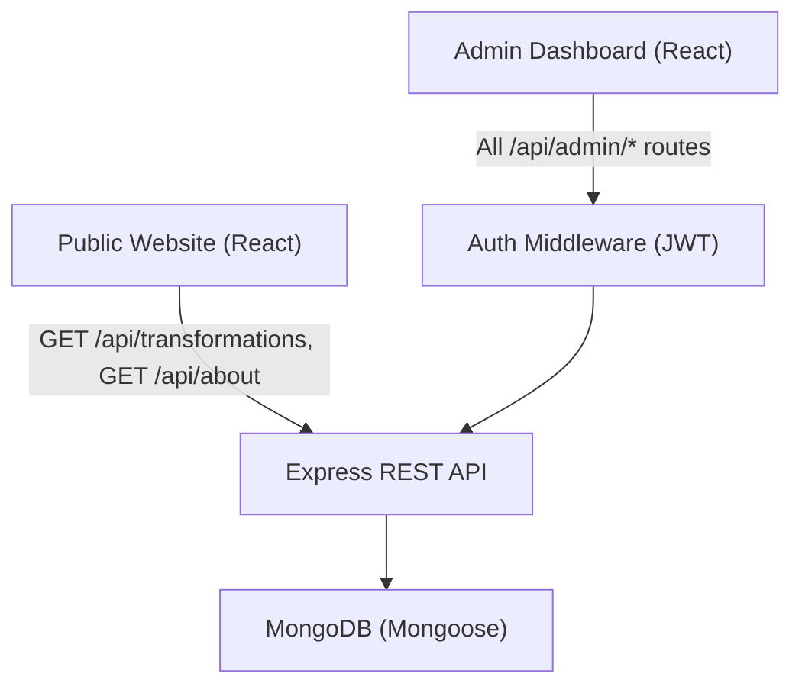
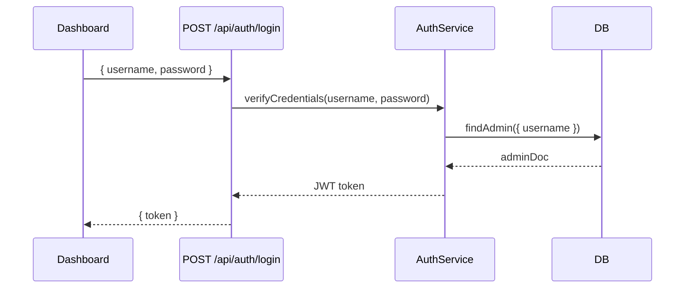
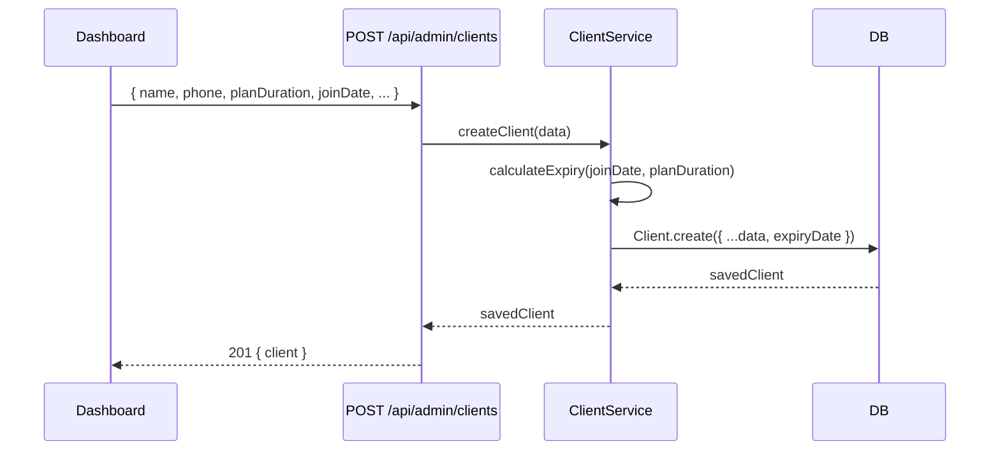

# Design Document: Gym Trainer Backend

## Overview

A lightweight REST API backend for a single-trainer gym management platform built with Node.js (Express) and MongoDB (Mongoose). It serves two consumers: a public-facing website (already built in React) and a private admin dashboard accessible only to the trainer. The system replaces manual register-based tracking with a clean digital solution covering client management, payment tracking, subscription expiry, transformations, about content, and lead capture.

The design prioritises simplicity and real-world usability over architectural complexity. There is exactly one admin user (the trainer), no client-facing auth, no online payments, and no complex analytics.

---

## Architecture



### Layer Breakdown

- `routes/` — Express route definitions, grouped by domain
- `controllers/` — Request handlers, thin orchestration layer
- `services/` — Business logic (expiry calculation, payment extension, reminder logic)
- `models/` — Mongoose schemas
- `middleware/` — JWT auth, error handler, file upload (multer)
- `utils/` — Date helpers, response formatters

---

## Sequence Diagrams

### Admin Login Flow



### Add Client + Auto-Expiry Calculation



### Record Payment + Extend Subscription

```mermaid
sequenceDiagram
    participant Dashboard
    participant POST /api/admin/clients/:id/payments
    participant PaymentService
    participant DB

    Dashboard->>POST /api/admin/clients/:id/payments: { amount, planDuration, paidAt }
    POST /api/admin/clients/:id/payments->>PaymentService: recordPayment(clientId, data)
    PaymentService->>DB: Client.findById(clientId)
    DB-->>PaymentService: client
    PaymentService->>PaymentService: extendExpiry(client.expiryDate, planDuration)
    PaymentService->>DB: Payment.create({ clientId, amount, ... })
    PaymentService->>DB: Client.updateOne({ expiryDate: newExpiry })
    DB-->>PaymentService: ok
    PaymentService-->>POST /api/admin/clients/:id/payments: { payment, newExpiryDate }
    POST /api/admin/clients/:id/payments-->>Dashboard: 201 { payment, newExpiryDate }
```

---

## Components and Interfaces

### AuthService

**Purpose**: Validate trainer credentials and issue JWT tokens.

**Interface**:
```typescript
interface AuthService {
  verifyCredentials(username: string, password: string): Promise<string> // returns JWT
  verifyToken(token: string): AdminPayload
}
```

**Responsibilities**:
- Compare bcrypt-hashed password stored in env/DB
- Sign JWT with configurable expiry (default 7d)
- Stateless — no session storage

---

### ClientService

**Purpose**: CRUD for clients plus expiry status classification.

**Interface**:
```typescript
interface ClientService {
  createClient(data: CreateClientDTO): Promise<Client>
  updateClient(id: string, data: UpdateClientDTO): Promise<Client>
  deleteClient(id: string): Promise<void>
  listClients(filters?: ClientFilters): Promise<Client[]>
  getClient(id: string): Promise<Client>
  classifyExpiry(expiryDate: Date): ExpiryStatus  // 'active' | 'expiring_soon' | 'expired'
}
```

**Responsibilities**:
- Auto-calculate `expiryDate` from `joinDate + planDuration`
- Classify clients by expiry status on read
- Validate required fields (name, phone)

---

### PaymentService

**Purpose**: Record payments and extend client subscriptions.

**Interface**:
```typescript
interface PaymentService {
  recordPayment(clientId: string, data: CreatePaymentDTO): Promise<{ payment: Payment, newExpiryDate: Date }>
  getPaymentHistory(clientId: string): Promise<Payment[]>
  getPaidUnpaidSummary(): Promise<PaymentSummary>
}
```

**Responsibilities**:
- Extend `expiryDate` from max(today, currentExpiry) + planDuration months
- Store full payment history per client
- Track `lastPaymentDate` on client document

---

### ReminderService

**Purpose**: Identify clients needing renewal reminders (logic only, no messaging).

**Interface**:
```typescript
interface ReminderService {
  getReminders(): Promise<ReminderResult>
}

interface ReminderResult {
  today: Client[]       // expiring today
  in2Days: Client[]     // expiring in 2 days
  in7Days: Client[]     // expiring in 7 days
}
```

**Responsibilities**:
- Query DB for clients whose `expiryDate` falls on target dates
- Return structured data ready for SMS/WhatsApp integration later

---

### TransformationService

**Purpose**: Manage before/after transformation entries for the public website.

**Interface**:
```typescript
interface TransformationService {
  addTransformation(data: CreateTransformationDTO, files: UploadedFiles): Promise<Transformation>
  listTransformations(): Promise<Transformation[]>
  deleteTransformation(id: string): Promise<void>
}
```

**Responsibilities**:
- Handle image uploads via multer (store locally or cloud path)
- Serve transformation list to public website (no auth required)

---

### AboutService

**Purpose**: Manage trainer profile content served to the public website.

**Interface**:
```typescript
interface AboutService {
  getAbout(): Promise<AboutContent>
  updateAbout(data: UpdateAboutDTO): Promise<AboutContent>
}
```

---

### DashboardService

**Purpose**: Aggregate stats for the admin dashboard home screen.

**Interface**:
```typescript
interface DashboardService {
  getStats(): Promise<DashboardStats>
}

interface DashboardStats {
  totalClients: number
  activeClients: number
  expiringSoon: number   // within 7 days
  monthlyRevenue: number // sum of payments this calendar month
}
```

---

### LeadService (Optional)

**Purpose**: Capture and manage prospective client leads.

**Interface**:
```typescript
interface LeadService {
  createLead(data: CreateLeadDTO): Promise<Lead>
  listLeads(filters?: LeadFilters): Promise<Lead[]>
  updateLeadStatus(id: string, status: LeadStatus): Promise<Lead>
}
```

---

## Data Models

### Admin

```typescript
interface Admin {
  _id: ObjectId
  username: string        // unique
  passwordHash: string    // bcrypt
  createdAt: Date
}
```

Single document. Seeded via script on first deploy.

---

### Client

```typescript
interface Client {
  _id: ObjectId
  name: string            // required
  phone: string           // required, unique
  email?: string
  joinDate: Date          // required, default: now
  planDuration: number    // months, required
  expiryDate: Date        // auto-calculated
  personalTraining: boolean  // default: false
  notes?: string
  lastPaymentDate?: Date
  createdAt: Date
  updatedAt: Date
}
```

**Validation Rules**:
- `phone` must be non-empty and unique
- `planDuration` must be >= 1
- `expiryDate` = `joinDate` + `planDuration` months (set by service, not client)

---

### Payment

```typescript
interface Payment {
  _id: ObjectId
  clientId: ObjectId      // ref: Client, required
  amount: number          // required
  planDuration: number    // months this payment covers
  paidAt: Date            // default: now
  notes?: string
  createdAt: Date
}
```

---

### Transformation

```typescript
interface Transformation {
  _id: ObjectId
  clientName?: string
  duration: string        // e.g. "3 months"
  resultDescription: string
  beforeImageUrl: string
  afterImageUrl: string
  createdAt: Date
}
```

---

### AboutContent

```typescript
interface AboutContent {
  _id: ObjectId
  trainerName: string
  bio: string
  milestones: Milestone[]
  profileImageUrl?: string
  updatedAt: Date
}

interface Milestone {
  year: string
  description: string
}
```

Single document (upserted on update).

---

### Lead (Optional)

```typescript
interface Lead {
  _id: ObjectId
  name: string            // required
  phone: string           // required
  goal?: string
  status: 'new' | 'contacted' | 'converted' | 'not_interested'  // default: 'new'
  createdAt: Date
  updatedAt: Date
}
```

---

## API Routes

### Auth
| Method | Path | Auth | Description |
|--------|------|------|-------------|
| POST | `/api/auth/login` | No | Trainer login → JWT |

### Clients (Admin)
| Method | Path | Auth | Description |
|--------|------|------|-------------|
| GET | `/api/admin/clients` | Yes | List all clients (with expiry status) |
| POST | `/api/admin/clients` | Yes | Create client |
| GET | `/api/admin/clients/:id` | Yes | Get single client |
| PUT | `/api/admin/clients/:id` | Yes | Update client |
| DELETE | `/api/admin/clients/:id` | Yes | Delete client |

### Payments (Admin)
| Method | Path | Auth | Description |
|--------|------|------|-------------|
| POST | `/api/admin/clients/:id/payments` | Yes | Record payment + extend subscription |
| GET | `/api/admin/clients/:id/payments` | Yes | Payment history for client |
| GET | `/api/admin/payments/summary` | Yes | Paid vs unpaid summary |

### Expiry & Reminders (Admin)
| Method | Path | Auth | Description |
|--------|------|------|-------------|
| GET | `/api/admin/reminders` | Yes | Clients expiring today / in 2d / in 7d |

### Dashboard (Admin)
| Method | Path | Auth | Description |
|--------|------|------|-------------|
| GET | `/api/admin/dashboard` | Yes | Aggregated stats |

### Transformations
| Method | Path | Auth | Description |
|--------|------|------|-------------|
| GET | `/api/transformations` | No | List all (public) |
| POST | `/api/admin/transformations` | Yes | Add transformation + images |
| DELETE | `/api/admin/transformations/:id` | Yes | Delete transformation |

### About
| Method | Path | Auth | Description |
|--------|------|------|-------------|
| GET | `/api/about` | No | Get about content (public) |
| PUT | `/api/admin/about` | Yes | Update about content |

### Leads (Optional)
| Method | Path | Auth | Description |
|--------|------|------|-------------|
| POST | `/api/leads` | No | Submit lead (public form) |
| GET | `/api/admin/leads` | Yes | List leads |
| PUT | `/api/admin/leads/:id/status` | Yes | Update lead status |

---

## Algorithmic Pseudocode

### calculateExpiry(joinDate, planDuration)

```pascal
FUNCTION calculateExpiry(joinDate: Date, planDuration: number): Date
  INPUT: joinDate — the date the client joined or last renewed
         planDuration — number of months the plan covers
  OUTPUT: expiryDate — the date the subscription ends

  PRECONDITION: joinDate IS valid Date AND planDuration >= 1

  BEGIN
    expiryDate ← new Date(joinDate)
    expiryDate.setMonth(expiryDate.getMonth() + planDuration)
    RETURN expiryDate
  END

  POSTCONDITION: expiryDate > joinDate
END FUNCTION
```

---

### extendExpiry(currentExpiry, planDuration)

```pascal
FUNCTION extendExpiry(currentExpiry: Date, planDuration: number): Date
  INPUT: currentExpiry — client's current expiry date
         planDuration — months the new payment covers
  OUTPUT: newExpiry — extended expiry date

  PRECONDITION: planDuration >= 1

  BEGIN
    baseDate ← MAX(today, currentExpiry)
    // If already expired, extend from today; otherwise extend from current expiry
    newExpiry ← new Date(baseDate)
    newExpiry.setMonth(newExpiry.getMonth() + planDuration)
    RETURN newExpiry
  END

  POSTCONDITION: newExpiry > today
END FUNCTION
```

**Loop Invariants**: N/A (no loops)

---

### classifyExpiry(expiryDate)

```pascal
FUNCTION classifyExpiry(expiryDate: Date): ExpiryStatus
  INPUT: expiryDate — client's subscription end date
  OUTPUT: status — one of 'active' | 'expiring_soon' | 'expired'

  PRECONDITION: expiryDate IS valid Date

  BEGIN
    today ← startOfDay(now())
    daysUntilExpiry ← diffInDays(expiryDate, today)

    IF daysUntilExpiry < 0 THEN
      RETURN 'expired'
    ELSE IF daysUntilExpiry <= 7 THEN
      RETURN 'expiring_soon'
    ELSE
      RETURN 'active'
    END IF
  END

  POSTCONDITION: result ∈ { 'active', 'expiring_soon', 'expired' }
END FUNCTION
```

---

### getReminders()

```pascal
FUNCTION getReminders(): ReminderResult
  OUTPUT: { today: Client[], in2Days: Client[], in7Days: Client[] }

  BEGIN
    todayStart ← startOfDay(now())
    todayEnd   ← endOfDay(now())

    in2Start ← startOfDay(addDays(now(), 2))
    in2End   ← endOfDay(addDays(now(), 2))

    in7Start ← startOfDay(addDays(now(), 7))
    in7End   ← endOfDay(addDays(now(), 7))

    todayClients  ← DB.Client.find({ expiryDate: { $gte: todayStart, $lte: todayEnd } })
    in2DayClients ← DB.Client.find({ expiryDate: { $gte: in2Start,   $lte: in2End   } })
    in7DayClients ← DB.Client.find({ expiryDate: { $gte: in7Start,   $lte: in7End   } })

    RETURN { today: todayClients, in2Days: in2DayClients, in7Days: in7DayClients }
  END

  POSTCONDITION: All returned clients have expiryDate within their respective windows
END FUNCTION
```

---

### getDashboardStats()

```pascal
FUNCTION getDashboardStats(): DashboardStats
  BEGIN
    today        ← startOfDay(now())
    in7Days      ← addDays(today, 7)
    monthStart   ← startOfMonth(now())
    monthEnd     ← endOfMonth(now())

    totalClients    ← DB.Client.countDocuments({})
    activeClients   ← DB.Client.countDocuments({ expiryDate: { $gt: in7Days } })
    expiringSoon    ← DB.Client.countDocuments({ expiryDate: { $gte: today, $lte: in7Days } })
    monthlyRevenue  ← DB.Payment.aggregate([
                        { $match: { paidAt: { $gte: monthStart, $lte: monthEnd } } },
                        { $group: { _id: null, total: { $sum: "$amount" } } }
                      ])

    RETURN {
      totalClients,
      activeClients,
      expiringSoon,
      monthlyRevenue: monthlyRevenue[0]?.total ?? 0
    }
  END
END FUNCTION
```

---

## Key Functions with Formal Specifications

### POST /api/admin/clients — createClient controller

```typescript
async function createClient(req: Request, res: Response): Promise<void>
```

**Preconditions**:
- `req.body.name` is non-empty string
- `req.body.phone` is non-empty string
- `req.body.planDuration` is integer >= 1
- JWT token is valid (enforced by auth middleware)

**Postconditions**:
- New `Client` document exists in DB with auto-calculated `expiryDate`
- Response is `201` with the created client object
- If `phone` already exists: response is `409 Conflict`

---

### POST /api/admin/clients/:id/payments — recordPayment controller

```typescript
async function recordPayment(req: Request, res: Response): Promise<void>
```

**Preconditions**:
- `req.params.id` is a valid existing Client `_id`
- `req.body.amount` is number > 0
- `req.body.planDuration` is integer >= 1

**Postconditions**:
- New `Payment` document created referencing `clientId`
- `Client.expiryDate` updated to `extendExpiry(currentExpiry, planDuration)`
- `Client.lastPaymentDate` updated to `paidAt`
- Response is `201` with `{ payment, newExpiryDate }`

---

### GET /api/admin/clients — listClients controller

```typescript
async function listClients(req: Request, res: Response): Promise<void>
```

**Preconditions**:
- JWT token is valid

**Postconditions**:
- Returns array of all clients, each decorated with computed `expiryStatus` field
- `expiryStatus` ∈ `{ 'active', 'expiring_soon', 'expired' }`
- Response is `200`

---

## Error Handling

### Scenario 1: Invalid/Missing JWT

**Condition**: Request to protected route without valid `Authorization: Bearer <token>` header
**Response**: `401 Unauthorized` `{ error: "Unauthorized" }`
**Recovery**: Client redirects to login

### Scenario 2: Client Not Found

**Condition**: `GET/PUT/DELETE /api/admin/clients/:id` with non-existent ID
**Response**: `404 Not Found` `{ error: "Client not found" }`

### Scenario 3: Duplicate Phone

**Condition**: Creating/updating client with a phone number already in DB
**Response**: `409 Conflict` `{ error: "Phone number already registered" }`

### Scenario 4: Validation Error

**Condition**: Missing required fields or invalid types in request body
**Response**: `400 Bad Request` `{ error: "Validation failed", details: [...] }`

### Scenario 5: File Upload Error

**Condition**: Image upload fails (size limit, wrong type)
**Response**: `400 Bad Request` `{ error: "Invalid file. Max 5MB, JPEG/PNG only" }`

### Scenario 6: Internal Server Error

**Condition**: Unhandled DB error or unexpected exception
**Response**: `500 Internal Server Error` `{ error: "Internal server error" }`
**Recovery**: Centralised error handler middleware catches and logs all unhandled errors

---

## Testing Strategy

### Unit Testing Approach

Test pure service functions in isolation with mocked Mongoose models.

Key unit tests:
- `calculateExpiry` — various plan durations, month boundary cases
- `extendExpiry` — expired client (base from today), active client (base from expiry)
- `classifyExpiry` — boundary: exactly 7 days, 0 days, -1 days
- `getReminders` — date window queries return correct client sets
- `getDashboardStats` — aggregation returns correct counts and revenue

### Property-Based Testing Approach

**Property Test Library**: fast-check

Properties to verify:
- `∀ joinDate, planDuration >= 1 → calculateExpiry(joinDate, planDuration) > joinDate`
- `∀ expiryDate → classifyExpiry(expiryDate) ∈ { 'active', 'expiring_soon', 'expired' }`
- `∀ currentExpiry, planDuration >= 1 → extendExpiry(currentExpiry, planDuration) > today`
- `∀ payment recorded → client.expiryDate strictly increases`

### Integration Testing Approach

Use `supertest` + in-memory MongoDB (`mongodb-memory-server`) for route-level tests:
- Full auth flow: login → receive token → use token on protected route
- Client lifecycle: create → read → update → delete
- Payment flow: record payment → verify expiry extended on client document
- Public routes accessible without token; admin routes blocked without token

---

## Performance Considerations

- MongoDB indexes on: `Client.phone` (unique), `Client.expiryDate` (for expiry queries), `Payment.clientId`, `Payment.paidAt`
- Dashboard stats use a single aggregation pipeline — no N+1 queries
- Image uploads stored locally under `/uploads` (or swap to S3 path later) — no base64 in DB
- All list endpoints support optional pagination (`?page=1&limit=20`) for future scale

---

## Security Considerations

- Passwords stored as bcrypt hashes (cost factor 12)
- JWT secret loaded from environment variable, never hardcoded
- JWT expiry: 7 days (configurable via `JWT_EXPIRES_IN` env var)
- File uploads: type whitelist (JPEG, PNG), max size 5MB via multer
- CORS configured to allow only the frontend origin
- No client-facing auth surface — reduces attack surface significantly
- Rate limiting on `/api/auth/login` (e.g. 10 req/15min via `express-rate-limit`)

---

## Project Structure

```
backend/
├── src/
│   ├── server.ts              # Express app entry point
│   ├── config/
│   │   └── db.ts              # Mongoose connection
│   ├── middleware/
│   │   ├── auth.ts            # JWT verification middleware
│   │   ├── errorHandler.ts    # Centralised error handler
│   │   └── upload.ts          # Multer config
│   ├── models/
│   │   ├── Admin.ts
│   │   ├── Client.ts
│   │   ├── Payment.ts
│   │   ├── Transformation.ts
│   │   ├── AboutContent.ts
│   │   └── Lead.ts
│   ├── services/
│   │   ├── authService.ts
│   │   ├── clientService.ts
│   │   ├── paymentService.ts
│   │   ├── reminderService.ts
│   │   ├── dashboardService.ts
│   │   ├── transformationService.ts
│   │   ├── aboutService.ts
│   │   └── leadService.ts
│   ├── controllers/
│   │   ├── authController.ts
│   │   ├── clientController.ts
│   │   ├── paymentController.ts
│   │   ├── reminderController.ts
│   │   ├── dashboardController.ts
│   │   ├── transformationController.ts
│   │   ├── aboutController.ts
│   │   └── leadController.ts
│   ├── routes/
│   │   ├── auth.ts
│   │   ├── admin.ts           # Mounts all admin sub-routes
│   │   ├── public.ts          # Transformations, About, Leads (public)
│   │   └── index.ts           # Root router
│   └── utils/
│       ├── dateHelpers.ts     # calculateExpiry, extendExpiry, classifyExpiry
│       └── response.ts        # Standardised response helpers
├── scripts/
│   └── seedAdmin.ts           # One-time admin seed script
├── uploads/                   # Local image storage
├── .env.example
├── package.json
└── tsconfig.json
```

---

## Dependencies

| Package | Purpose |
|---------|---------|
| `express` | HTTP framework |
| `mongoose` | MongoDB ODM |
| `bcryptjs` | Password hashing |
| `jsonwebtoken` | JWT signing/verification |
| `multer` | File upload handling |
| `express-rate-limit` | Rate limiting on auth routes |
| `cors` | CORS configuration |
| `dotenv` | Environment variable loading |
| `tsx` / `ts-node` | TypeScript execution (dev) |
| `jest` + `supertest` | Testing |
| `mongodb-memory-server` | In-memory MongoDB for tests |
| `fast-check` | Property-based testing |
